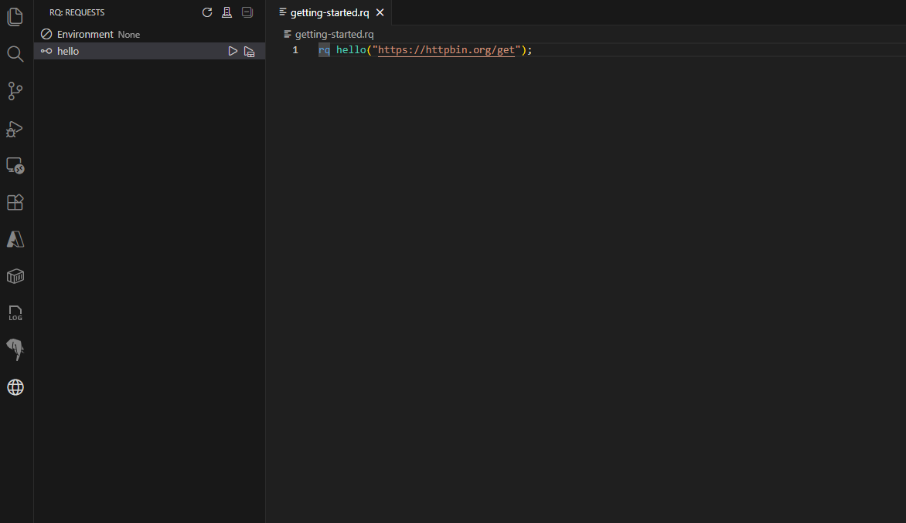
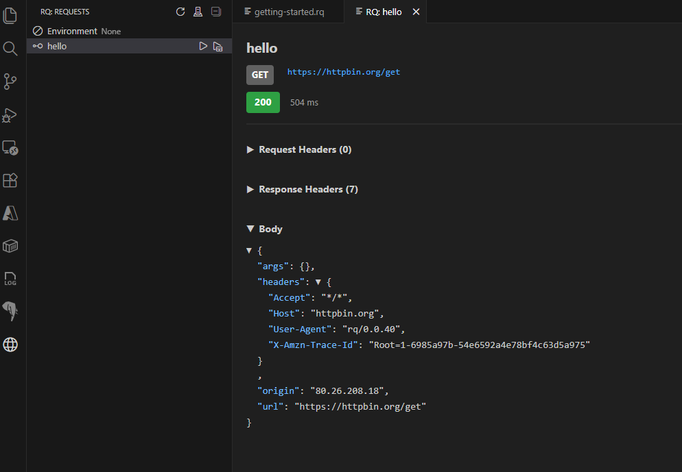

# Getting Started

This guide walks you through your first steps with **rq**, using the Visual Studio Code extension to create and execute a simple HTTP request.

If you have not installed rq yet (CLI and/or VS Code extension), please start with the [Installation](INSTALLATION.md) section and come back here once everything is set up.

## What You Will Do

In this quick tour you will:

- Create a new `.rq` file in a VS Code workspace.
- Define a simple HTTP request using the rq language.
- Execute the request from the VS Code UI.
- Inspect the response in the integrated viewer.

The goal is not to explain every part of the language in depth, but to give you an intuitive feel for the workflow.

## Creating Your First `.rq` File

1. Open **Visual Studio Code**.
2. Open or create a folder you want to use as your workspace.
3. Inside that folder, create a new file named, for example, `getting-started.rq`.

Once the rq extension is installed and active, VS Code should automatically:

- Recognize the `.rq` file type.
- Enable syntax highlighting for rq.
- Show rq-specific commands in the Command Palette and/or a dedicated view.

## Writing a Simple Request

Paste the following minimal example into your new `getting-started.rq` file:

```rq
rq hello("https://httpbin.org/get");
```

This defines a single HTTP `GET` request named `hello` that targets `https://httpbin.org/get`.

Conceptually:

- `rq hello(...)` declares a request called `hello`.
- The string inside the parentheses is the URL to call.

Later sections (see [Language Definition](LANGUAGE_DEFINITION.md)) will cover how to add headers, bodies, variables, and more advanced features. For now, we focus on running this simple request from the UI.

## Executing the Request from VS Code

1. Make sure you have saved your `getting-started.rq` file.
2. Open the **rq Request Explorer** view (for example, from the Activity Bar or the View menu in VS Code).
3. If the explorer was already open before you saved the file, click the **Refresh** button to reload the list of requests.
4. Locate the `hello` request in the explorer.
5. Click the **Run** button (or play icon) next to `hello`.



When you run the `hello` request from the explorer, the extension will:

- Parse the `.rq` file.
- Resolve the `hello` request definition.
- Execute the corresponding HTTP call.

If everything works correctly, you should see the response displayed in VS Code.

## Inspecting the Response



The extension provides a response viewer that typically includes:

- **Status line** (HTTP status code and reason phrase).
- **Response time** (how long the request took to complete).
- **Request headers**.
- **Response headers**.
- **Response body**, optionally formatted (e.g., as JSON) for easier reading.

For the `https://httpbin.org/get` example, you should see a JSON body that echoes information about your request (query parameters, headers, etc.). This is a convenient endpoint for experimenting while you learn rq.

Take a moment to:

- Scroll through the response body.
- Observe how the viewer renders JSON.
- Optionally, re-run the request to see that the behavior is repeatable.

## Next Steps

From here, you can continue in several directions:

- Learn more about the rq language itself in [Language Definition](LANGUAGE_DEFINITION.md).
- Explore additional VS Code features (request explorer, environment handling, etc.) in [VS Code Extension](VSCODE_EXTENSION.md).
- If you prefer the terminal, try running the same `.rq` file with the CLI as described in [CLI](CLI.md).

As rq is in preview, details of the UI or commands may evolve, but the overall workflow—define requests in `.rq` files and run them either from VS Code or the CLI—will remain the core experience.
