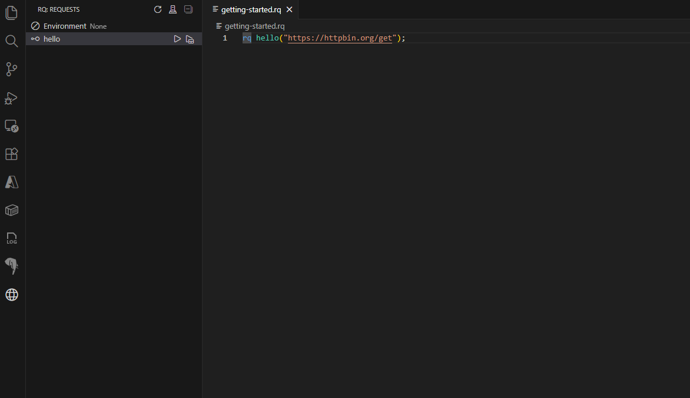
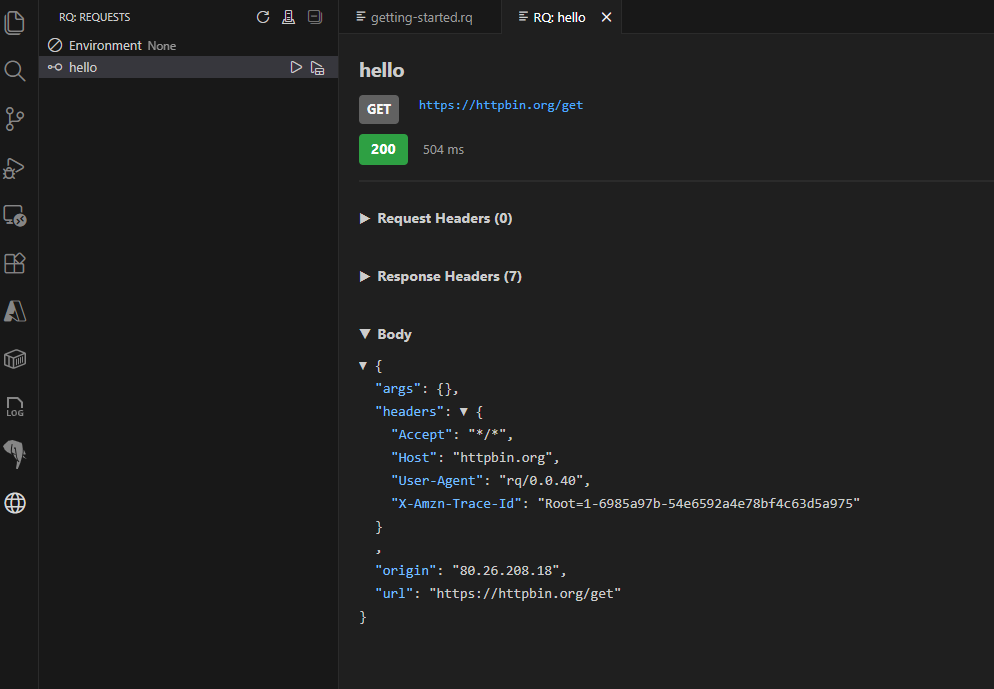

# Getting Started

Let's run your first request. Two minutes, start to finish.

First, make sure rq is installed — grab the CLI and/or VS Code extension from [Installation](INSTALLATION.md).

## 1. Write a request

Create a file called `getting-started.rq` and add one line:

```
rq hello("https://httpbin.org/get");
```

That's a `GET` request named `hello`. The string is the URL. Done.

## 2. Run it

Open the **rq Request Explorer** in VS Code, find `hello`, and hit **Run** (the play icon). If you don't see it, click **Refresh** — the explorer picks up new requests on reload.



## 3. Read the response

The viewer shows you the status, response time, headers, and body — JSON gets formatted automatically.



`httpbin.org/get` echoes your request back, so it's a handy playground while you're learning. Re-run it as much as you like.

## Where to next

- **[Advanced Example](ADVANCED_EXAMPLE.md)** — ready for more? Build a single request up into a real API suite, step by step.
- **[Language Definition](LANGUAGE_DEFINITION.md)** — headers, bodies, variables, auth, and everything else the `.rq` syntax can do.
- **[VS Code Extension](VSCODE_EXTENSION.md)** — environments, the request explorer, and other editor features.
- **[CLI](CLI.md)** — prefer the terminal? Run the same file from the command line.

rq is in preview, so the UI may shift around — but the core stays the same: define requests in `.rq` files, run them from VS Code or the CLI.
