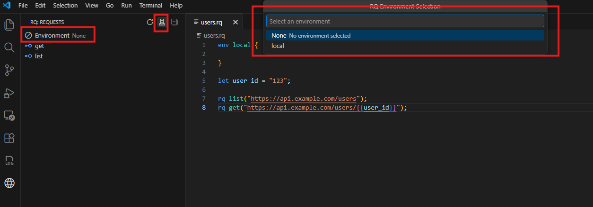

# VS Code Extension

The rq VS Code extension provides first-class support for editing and running `.rq` files directly from the editor. It is the most convenient way to explore the language, iterate on requests, and use interactive authentication flows.

If you haven't installed rq yet, see the [INSTALLATION guide](INSTALLATION.md) first.

This page describes the main features of the extension. For the language itself, see the [Language Definition](./LANGUAGE_DEFINITION.md).

## Language syntax support

The extension understands rq files and provides:

- **Syntax highlighting** for keywords (`let`, `rq`, `ep`, `env`, `auth`), HTTP methods, attributes, and interpolations.
- **Basic validation** of syntax errors surfaced in the VS Code **Problems** view.
- A tight integration with the rq CLI for executing requests.

For a complete description of the rq language (statements, variables, environments, auth, endpoints, imports, functions, etc.), refer to the [Language Definition](./LANGUAGE_DEFINITION.md).

## Request Explorer

The extension adds a dedicated **Request Explorer** view in the Activity Bar. It discovers `.rq` files in your workspace and organizes requests by folder and endpoint.

Key capabilities:

1. **Environment selection**

	
	- Use the environment selector at the top of the view to switch between environments (for example `local`, `dev`, `prod`).
	- The selected environment applies to all requests executed from the explorer and is resolved using the same rules described in [Environments](./LANGUAGE_DEFINITION.md#environments).

2. **Executing requests**

	- **Run**: Click the "Run" icon next to a request to execute it immediately with the currently selected environment.
	- **Run with variables**: Click the "Run with Variables" icon to provide runtime overrides for variables.
		- The extension prompts for variables in `key=value` format (for example `userId=123`).
		- You can provide multiple pairs one after another; they are passed to the engine as execution-time variables with the highest precedence.

3. **Navigation & browsing**

	- The tree groups requests by folder and endpoint structure (for example, endpoint-based requests appear under their `ep` name).
	- Clicking a request opens the corresponding `.rq` file and jumps directly to the definition of that request.

## IntelliSense & autocomplete

To make editing `.rq` files comfortable, the extension offers IntelliSense in several places:

- **System functions**: Suggestions and inline documentation for built-in functions such as `io.read_file`, `random.guid`, and `datetime.now`.
- **Variables**: Completion for available variables, including `let` bindings, environment variables, and some language constructs. Interpolations like `{{variable}}` include hover information where possible.
- **Request and endpoint parameters**: Context-aware suggestions for named parameters on `rq` and `ep` (such as `url`, `headers`, `body`, `qs`, `timeout`), as well as attributes like `[timeout(...)]` and `[auth("...")]`.

The goal is to mirror the semantics described in the language definition, so that incorrect names or unsupported parameters are easy to spot while editing.

## Syntax highlighting and errors

The extension ships with a TextMate grammar for rq, providing:

- Highlighting for keywords, identifiers, HTTP methods, attributes, strings, interpolations, and comments.
- Clear coloring for block constructs (`env`, `ep`, `auth`, `rq`).

Basic syntax errors are reported via the Problems panel:

- Parse errors detected by the rq parser (for example missing braces, invalid attributes, unknown auth fields) are surfaced with file, line, and column.
- These diagnostics help you fix issues before running requests.

> **Note**: Currently, error checking is refreshed when you interact with the RQ Explorer (e.g., expanding or refreshing items). A Language Server implementation is in development to provide real-time diagnostics as you type.

As the language evolves, additional validation (for example semantic checks) may be added by the extension.

## Interactive OAuth authentication

The extension deeply integrates with rq's auth providers to support interactive OAuth-based flows.

When you run a request that uses an OAuth2-based auth provider (for example `oauth2_authorization_code` or `oauth2_implicit`):

- The extension detects that the flow requires user interaction.
- It guides you through the login/consent process and captures the resulting token.
- The token is then passed to the rq engine so the request can be executed.

Supported flows:

- **OAuth2 Implicit**
- **OAuth2 Authorization Code with PKCE**

Redirect handling:

The extension automatically selects the best handling strategy based on the `redirect_uri` configured in your auth `fields`:

1.  **VS Code URI Handler (`vscode://...`)**

	
	This is the **preferred and default option**. If you do not specify a `redirect_uri`, the extension automatically uses `vscode://rq-lang.rq-language/oauth-callback`.

	- **Why it is preferred**: This URI instructs the identity provider to redirect control directly back to the RQ extension. It provides the most seamless experience (no manual copy-pasting) and works reliable across local setups, WSL, SSH remotes, and Codespaces without needing to open local ports.

	- **Process**:
		1. Extension opens your browser for login.
		2. After login, the browser asks to "Open Visual Studio Code".
		3. VS Code catches the callback automatically.
		4. The token is retrieved without manual copy-pasting.

2.  **Localhost Server (`http://localhost:...`)**

	Use this if your matching provider supports `localhost` redirects but not custom protocols.

	- **Example**: `http://localhost:3000/callback`
	- **Process**:
		1. Extension temporarily starts a local HTTP server on the specified port.
		2. Extension opens your browser for login.
		3. After login, the browser redirects to your localhost port.
		4. The local server captures the code/token and shows a success page.
		5. The extension stops the server and proceeds.

3.  **Manual / Custom URLs**

	Use this as a fallback for any other URL (e.g., production callbacks).

	- **Example**: `https://my-api.com/auth/callback`
	- **Process**:
		1. Extension opens your browser for login.
		2. You complete the login flow until you land on the final redirect page.
		3. VS Code shows an input box asking for the full URL.
		4. You copy the URL from your browser's address bar and paste it into VS Code.
		5. The extension parses the code/token from the pasted URL.

These flows are designed to work hand in hand with the language-level auth configuration described in [Auth](./LANGUAGE_DEFINITION.md#auth).

Additionally, you can:

- Use the command `RQ: Get Token` to trigger token acquisition explicitly, without sending a request. When invoking this command, you will be prompted for an environment (optional) and an auth provider name as input parameters. Both the environment and the auth provider must be defined in the `.rq` files under the current workspace folder.
- Use the command `RQ: Clear OAuth Cache` to clear cached tokens and force a new login.

Tokens obtained through these flows are cached using VS Code's native [authentication API](https://code.visualstudio.com/api/references/vscode-api#authentication), so they can be reused across requests until you clear them or they expire.