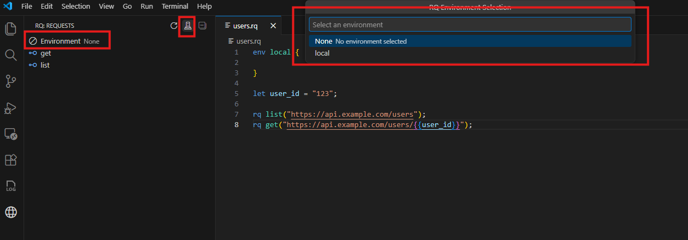

# VS Code Extension

The rq VS Code extension provides first-class support for editing and running `.rq` files directly from the editor. It is the most convenient way to explore the language, iterate on requests, and use interactive authentication flows.

If you haven't installed rq yet, see the [INSTALLATION guide](INSTALLATION.md) first.

This page describes the main features of the extension. For the language itself, see the [Language Definition](./LANGUAGE_DEFINITION.md).

## Language syntax support

The extension understands rq files and provides:

- **Syntax highlighting** for keywords (`let`, `rq`, `ep`, `env`, `auth`), HTTP methods, attributes, and interpolations.
- **Real-time diagnostics** powered by the built-in language server — syntax and semantic errors are surfaced in the VS Code **Problems** view as you type, without needing to run anything.
- **IntelliSense autocomplete, hover tooltips, navigation actions, and snippets** for common rq constructs (see [IntelliSense & language features](#intellisense--language-features) below).
- A tight integration with the rq CLI for executing requests.

For a complete description of the rq language (statements, variables, environments, auth, endpoints, imports, functions, etc.), refer to the [Language Definition](./LANGUAGE_DEFINITION.md).

## Request Explorer

The extension adds a dedicated **Request Explorer** view in the Activity Bar. It discovers `.rq` files in your workspace and organizes requests by folder and endpoint.

Key capabilities:

1. **Environment selection**

	
	- Use the environment selector at the top of the view to switch between environments (for example `local`, `dev`, `prod`).
	- The selected environment applies to all requests executed from the explorer and is resolved using the same rules described in [Environments](./LANGUAGE_DEFINITION.md#environments).
	- If a variable is only defined within a specific environment block, the language server will report it as an error until that environment is selected. This is expected — switch to the right environment and the error will clear.

2. **Executing requests**

	- **Run**: Click the "Run" icon next to a request to execute it immediately with the currently selected environment.
	- **Run with variables**: Click the "Run with Variables" icon to provide runtime overrides for variables.
		- The extension prompts for variables in `key=value` format (for example `userId=123`).
		- You can provide multiple pairs one after another; they are passed to the engine as execution-time variables with the highest precedence.

3. **Navigation & browsing**

	- The tree groups requests by folder and endpoint structure (for example, endpoint-based requests appear under their `ep` name).
	- Clicking a request opens the corresponding `.rq` file and jumps directly to the definition of that request.
	- **Environments and auth providers** defined in `.rq` files are listed under a **Configuration** section in the tree, so you can inspect them without opening the file manually.

## Response panel

After a request runs, the extension opens a **response panel** showing the status code, response headers, and formatted body.

- Use the **Copy** button in the panel to copy the response body to the clipboard.
- For execution errors (network failures, interpolation issues, auth problems), check the **RQ** output channel via **View → Output → RQ** for the full details.

## IntelliSense & language features

The extension ships a built-in language server that analyses your `.rq` files as you edit them. This means you get meaningful feedback and editor assistance without having to run a single request.

### Autocomplete

Context-aware suggestions are available throughout:

- **Keywords and snippets**: Templates for `rq`, `ep`, `env`, `auth`, and common constructs to get you started quickly.
- **System functions**: Suggestions for built-in functions such as `io.read_file`, `random.guid`, and `datetime.now`.
- **Defined objects**: The editor suggests variables, request names, environment names, and auth providers that are already declared in the file or imported files.
- **Object parameters**: Named parameters for `rq` (e.g. `url`, `headers`, `body`) and `ep` (e.g. `url`, `headers`, `qs`) are suggested in context, so you never have to guess valid field names.
- **Auth properties**: When defining an `auth` block, the available fields are filtered by the selected `auth_type` — you only see what is relevant.
- **Attributes**: Valid request attributes (e.g. `[method(...)]`, `[timeout(...)]`, `[auth("...")]`) are suggested when writing attribute lines.
- **Imports**: Typing `import` triggers suggestions for other `.rq` files found in the workspace.

### Hover tooltips

Hovering over an `rq`, `ep`, `env`, or `auth` statement shows a summary of its definition inline, without having to navigate to it.

### Navigation

- **Go to definition**: Jump to the declaration of any request, variable, environment, or auth provider with the standard VS Code shortcut (`F12` or right-click → Go to Definition).
- **Find all references**: See every place a symbol is used across the file (`Shift+F12` or right-click → Find All References).
- **Rename symbol**: Rename a request, variable, auth provider, or environment name consistently across the workspace (`F2` or right-click → Rename Symbol).

### Format document

The extension can format the current `.rq` file using the standard VS Code **Format Document** command (`Shift+Alt+F` on Windows/Linux, `Shift+Option+F` on macOS). This normalises indentation and spacing to keep files consistent.

## Syntax highlighting and errors

The extension ships with a TextMate grammar for rq, providing:

- Highlighting for keywords, identifiers, HTTP methods, attributes, strings, interpolations, and comments.
- Clear coloring for block constructs (`env`, `ep`, `auth`, `rq`).

### Parse and semantic errors

Errors are surfaced in two places depending on their nature:

- **Problems panel**: Parse and semantic errors (missing braces, invalid attributes, unknown auth fields, duplicate identifiers, missing variables, etc.) are reported with file, line, and column as you type. These are detected by the language server in real time — no need to trigger a request to see them.
- **Output panel**: Errors that occur at execution time (for example, a failed HTTP request, a runtime interpolation error, or an auth flow problem) are written to the **RQ** output channel. Open it via **View → Output** and select **RQ** from the dropdown to see execution logs and error details.

## Interactive OAuth authentication

The extension deeply integrates with rq's auth providers to support interactive OAuth-based flows.

When you run a request that uses an OAuth2-based auth provider (for example `oauth2_authorization_code` or `oauth2_implicit`):

- The extension detects that the flow requires user interaction.
- It guides you through the login/consent process and captures the resulting token.
- The token is then passed to the rq engine so the request can be executed.
- The access token is cached using VS Code's standard secrets API so it can be safely reused in later flows.

Supported flows:

- **OAuth2 Implicit**
- **OAuth2 Authorization Code with PKCE**

Redirect handling:

The extension automatically selects the best handling strategy based on the `redirect_uri` configured in your auth `fields`:

1.  **VS Code URI Handler (`vscode://...`)**

	
	This is the **preferred and default option**. If you do not specify a `redirect_uri`, the extension automatically uses `vscode://rq-lang.rq-language/oauth-callback`.

	- **Why it is preferred**: This URI instructs the identity provider to redirect control directly back to the RQ extension. It provides the most seamless experience (no manual copy-pasting) and works reliable across local setups, WSL, SSH remotes, and Codespaces without needing to open local ports.

	- **Process**:
		1. Extension opens your browser for login.
		2. After login, the browser asks to "Open Visual Studio Code".
		3. VS Code catches the callback automatically.
		4. The token is retrieved without manual copy-pasting.

2.  **Localhost Server (`http://localhost:...`)**

	Use this if your matching provider supports `localhost` redirects but not custom protocols.

	- **Example**: `http://localhost:3000/callback`
	- **Process**:
		1. Extension temporarily starts a local HTTP server on the specified port.
		2. Extension opens your browser for login.
		3. After login, the browser redirects to your localhost port.
		4. The local server captures the code/token and shows a success page.
		5. The extension stops the server and proceeds.

3.  **Manual / Custom URLs**

	Use this as a fallback for any other URL (e.g., production callbacks).

	- **Example**: `https://my-api.com/auth/callback`
	- **Process**:
		1. Extension opens your browser for login.
		2. You complete the login flow until you land on the final redirect page.
		3. VS Code shows an input box asking for the full URL.
		4. You copy the URL from your browser's address bar and paste it into VS Code.
		5. The extension parses the code/token from the pasted URL.

These flows are designed to work hand in hand with the language-level auth configuration described in [Auth](./LANGUAGE_DEFINITION.md#auth).

Additionally, you can:

- Use the command `RQ: Get Token` to trigger token acquisition explicitly, without sending a request. When invoking this command, you will be prompted for an environment (optional) and an auth provider name as input parameters. Both the environment and the auth provider must be defined in the `.rq` files under the current workspace folder.
- Use the command `RQ: Clear OAuth Cache` to clear cached tokens and force a new login.

Tokens obtained through these flows are cached using VS Code's native [authentication API](https://code.visualstudio.com/api/references/vscode-api#authentication), so they can be reused across requests until you clear them or they expire.